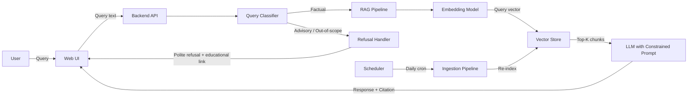
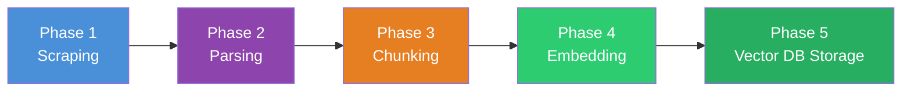
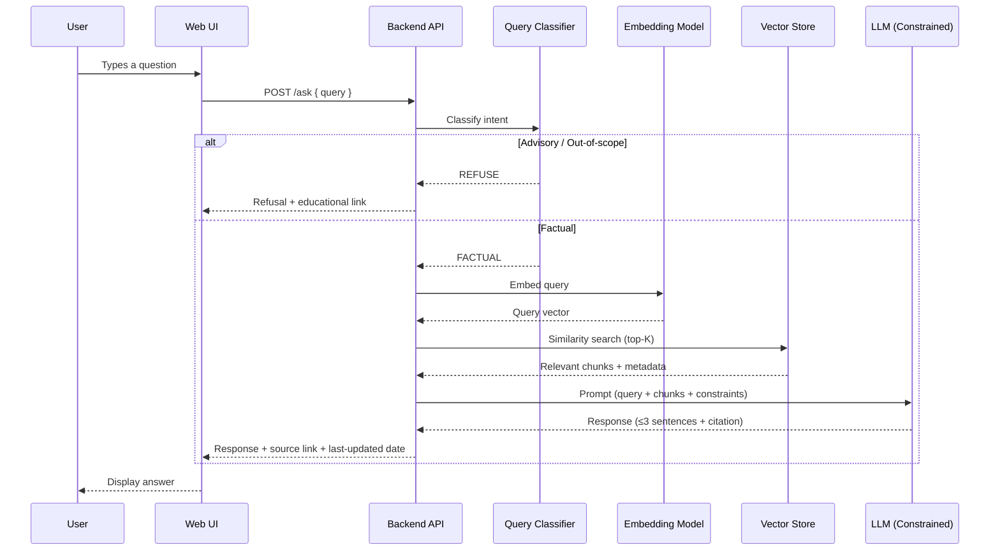

# Mutual Fund FAQ Assistant — Architecture

## 1. System Overview

The Mutual Fund FAQ Assistant is a **Retrieval-Augmented Generation (RAG)** application that answers factual queries about HDFC mutual fund schemes. It retrieves relevant information from a curated corpus of official documents and generates concise, source-backed responses using a constrained LLM prompt.



---

## 2. Architecture Layers

| Layer | Responsibility | Key Components |
|-------|---------------|----------------|
| **Presentation** | Chat UI, disclaimer, example questions | HTML/CSS/JS or Streamlit |
| **API** | Request handling, routing, session mgmt | FastAPI / Flask |
| **Query Classification** | Detect advisory vs. factual queries | Keyword rules + LLM classifier |
| **Retrieval** | Semantic search over corpus | Embedding model + Vector DB |
| **Generation** | Produce constrained, cited responses | Groq (LLM inference) |
| **Data Ingestion** | Scrape, chunk, embed, index documents | Scrapers + chunking pipeline |
| **Guardrails** | PII filtering, content policy enforcement | Pre/post-processing middleware |
| **Scheduler** | Automated daily re-ingestion of mutual fund data | APScheduler (cron trigger) |

---

## 3. Data Ingestion Pipeline

This pipeline runs **offline** (or on-demand) to build and update the vector store. It consists of **5 sequential phases**, automated by a **daily scheduler**.



The ingestion pipeline is triggered automatically by the **Scheduler** (Phase 11) at 06:00 UTC daily, ensuring the vector store always contains the latest mutual fund data. See [implementation-plan.md → Phase 11](file:///Users/iamprince/Desktop/Mutual%20Fund%20FAQ%20Assistant%20/docs/implementation-plan.md) for full details.

---

### Phase 1 — Scraping

Fetch raw HTML from the 5 Groww mutual fund scheme pages.

| # | Source URL | Format |
|---|-----------|--------|
| 1 | `groww.in/mutual-funds/hdfc-large-cap-fund-direct-growth` | HTML |
| 2 | `groww.in/mutual-funds/hdfc-mid-cap-fund-direct-growth` | HTML |
| 3 | `groww.in/mutual-funds/hdfc-small-cap-fund-direct-growth` | HTML |
| 4 | `groww.in/mutual-funds/hdfc-gold-etf-fund-of-fund-direct-plan-growth` | HTML |
| 5 | `groww.in/mutual-funds/hdfc-silver-etf-fof-direct-growth` | HTML |

- **Tool:** `requests` / `httpx` to fetch HTML content from each Groww URL.
- **Output:** Raw HTML files saved to `data/raw/`.

---

### Phase 2 — Parsing

Extract clean, structured text from the raw HTML.

- **Tool:** `BeautifulSoup` or `Trafilatura` to strip navigation, ads, scripts, and boilerplate.
- **Extract:** Scheme name, expense ratio, exit load, SIP details, benchmark, riskometer, and other factual fields.
- **Metadata attached per page:**

| Field | Example |
|-------|---------|
| `source_url` | `https://groww.in/mutual-funds/hdfc-large-cap-fund-direct-growth` |
| `scheme_name` | HDFC Large Cap Fund |
| `category` | Large Cap |
| `last_scraped_date` | 2026-07-10 |

- **Output:** Clean text files with metadata saved to `data/processed/`.

---

### Phase 3 — Chunking

Split the parsed text into smaller, overlapping chunks suitable for embedding and retrieval.

| Parameter | Value | Rationale |
|-----------|-------|-----------|
| **Chunk size** | ~500 tokens | Balance between context and retrieval precision |
| **Overlap** | ~50 tokens | Preserve cross-boundary context |
| **Method** | Recursive character splitting | Respects paragraph / section boundaries |
| **Metadata per chunk** | `source_url`, `scheme_name`, `category`, `section_heading` | Enables filtered retrieval + accurate citation |

- **Tool:** LangChain `RecursiveCharacterTextSplitter` or custom splitter.
- **Output:** Chunked documents with metadata saved to `data/chunks/` (JSON/JSONL).

---

### Phase 4 — Embedding

Convert each text chunk into a dense vector representation.

| Component | Choice | Notes |
|-----------|--------|-------|
| **Embedding model** | `BAAI/bge-small-en-v1.5` | High-quality open-source embedding model |
| **Vector dimensions** | 384 | Fixed for BGE-small |
| **Batch processing** | Process all chunks in batches | Efficient for the small corpus |

- **Input:** Text chunks + metadata from Phase 3.
- **Output:** Vector embeddings paired with their chunk metadata.

---

### Phase 5 — Storing in Vector Database

Persist the embeddings and metadata into a vector store for runtime retrieval.

| Component | Choice | Notes |
|-----------|--------|-------|
| **Vector store** | ChromaDB (local) or FAISS | Simple, no infra overhead |
| **Distance metric** | Cosine similarity | Standard for text embeddings |
| **Persistence** | Saved to `vectorstore/` directory | Survives restarts, no re-indexing needed |

- **Input:** Embeddings + metadata from Phase 4.
- **Output:** Indexed, queryable vector store ready for the runtime query pipeline.

---

## 4. Query Pipeline (Runtime)



### 4.1 Query Classification

The classifier determines whether a query is **factual** (answerable) or **advisory** (should be refused).

**Approach — Hybrid (rules + LLM fallback):**

| Method | Examples Caught |
|--------|-----------------|
| **Keyword blocklist** | "should I", "which is better", "recommend", "suggest", "advise" |
| **Intent patterns (regex)** | "is X a good fund", "invest in X or Y", "will X give returns" |
| **LLM classification (fallback)** | Ambiguous edge cases not caught by rules |

### 4.2 Retrieval

- Embed the user query using the same embedding model used during ingestion.
- Perform **cosine similarity search** against the vector store.
- Retrieve **top-K chunks** (K = 3–5).
- Optionally apply **metadata filters** (e.g., filter by `scheme_name` if detected in query).

### 4.3 Generation (Constrained LLM Prompt)

The LLM receives:
1. **System prompt** — hard constraints (facts-only, no advice, response format rules).
2. **Retrieved context** — top-K chunks with source metadata.
3. **User query** — the original question.

Response is post-processed to ensure:
- ≤ 3 sentences
- Exactly one citation link
- Footer: `"Last updated from sources: <date>"`

---

## 5. Prompt Engineering

### 5.1 System Prompt (Template)

```
You are a facts-only mutual fund FAQ assistant for HDFC Mutual Fund schemes.

RULES:
1. Answer ONLY using the provided context. Do NOT use prior knowledge.
2. Keep responses to a MAXIMUM of 3 sentences.
3. Include exactly ONE source citation link from the context metadata.
4. End every response with: "Last updated from sources: <date>"
5. NEVER provide investment advice, opinions, or recommendations.
6. NEVER compare fund performance or calculate returns.
7. If the context does not contain the answer, say:
   "I don't have this information in my sources. Please check [relevant official link]."
8. NEVER ask for or acknowledge PII (PAN, Aadhaar, account numbers, OTPs, email, phone).

CONTEXT:
{retrieved_chunks}

USER QUERY:
{user_query}
```

### 5.2 Refusal Prompt (Template)

```
The user asked an advisory or opinion-based question. Respond with:
1. A polite, 1-sentence refusal reinforcing the facts-only scope.
2. A relevant educational link from AMFI (amfiindia.com) or SEBI (sebi.gov.in).

USER QUERY:
{user_query}
```

---

## 6. Guardrails & Safety

### 6.1 Input Guardrails (Pre-processing)

| Guard | Action |
|-------|--------|
| **PII detection** | Regex scan for PAN, Aadhaar, phone, email patterns → reject with warning |
| **Query length limit** | Cap at 500 characters |
| **Injection attempts** | Strip prompt-injection patterns before passing to LLM |

### 6.2 Output Guardrails (Post-processing)

| Guard | Action |
|-------|--------|
| **Response length** | Truncate or re-generate if > 3 sentences |
| **Citation check** | Verify response contains exactly one valid source URL |
| **Advisory language scan** | Flag words like "should", "recommend", "better" in output |
| **PII leak check** | Scan output for any PII patterns before returning |
| **Footer enforcement** | Append `"Last updated from sources: <date>"` if missing |

---

## 7. Tech Stack (Recommended)

| Component | Technology | Reason |
|-----------|-----------|--------|
| **Language** | Python 3.10+ | ML/NLP ecosystem, rapid prototyping |
| **Web Framework** | FastAPI | Async, lightweight, auto-docs |
| **Frontend** | Streamlit *or* HTML/CSS/JS | Minimal UI requirement |
| **Embedding Model** | `BAAI/bge-small-en-v1.5` | High-quality, open-source, 384-dim |
| **Vector Store** | ChromaDB / FAISS | Local, zero-infra |
| **LLM** | Groq API (LLaMA / Mixtral via Groq) | Ultra-fast inference, free tier available |
| **Scraping** | BeautifulSoup + requests / Trafilatura | HTML extraction from Groww pages |
| **Chunking** | LangChain `RecursiveCharacterTextSplitter` | Proven, configurable |
| **Orchestration** | LangChain / LlamaIndex (optional) | RAG pipeline glue |

---

## 8. Project Structure

```
Mutual Fund FAQ Assistant/
├── docs/
│   ├── problemstatement.txt        # Original problem statement
│   ├── context.md                  # Project context & scope
│   └── architecture.md             # This document
├── data/
│   ├── raw/                        # Raw scraped HTML files from Groww
│   ├── processed/                  # Cleaned text files
│   └── chunks/                     # Chunked documents with metadata (JSON/JSONL)
├── vectorstore/                    # Persisted vector index (ChromaDB / FAISS)
├── src/
│   ├── ingestion/
│   │   ├── scraper.py              # Web scraper for Groww scheme pages
│   │   ├── chunker.py              # Text chunking logic
│   │   └── embedder.py             # Embedding + vector store indexing
│   ├── pipeline/
│   │   ├── query_classifier.py     # Factual vs. advisory classification
│   │   ├── retriever.py            # Vector similarity search
│   │   ├── generator.py            # LLM response generation
│   │   └── guardrails.py           # Input/output safety checks
│   ├── scheduler/
│   │   ├── __init__.py             # Scheduler sub-package init
│   │   ├── scheduler.py            # APScheduler config & lifecycle
│   │   └── jobs.py                 # Scheduled job functions (ingestion, staleness check)
│   ├── prompts/
│   │   ├── system_prompt.txt       # Main system prompt template
│   │   └── refusal_prompt.txt      # Refusal response template
│   ├── api/
│   │   └── main.py                 # FastAPI app & routes
│   └── ui/
│       └── app.py                  # Streamlit UI (or static HTML)
├── tests/
│   ├── test_classifier.py          # Query classification tests
│   ├── test_retriever.py           # Retrieval accuracy tests
│   ├── test_guardrails.py          # Guardrail unit tests
│   └── test_e2e.py                 # End-to-end response tests
├── scripts/
│   ├── ingest.py                   # Run full ingestion pipeline
│   └── evaluate.py                 # Evaluate response quality
├── .env.example                    # Environment variable template
├── requirements.txt                # Python dependencies
└── README.md                       # Setup & usage instructions
```

---

## 9. API Design

### `POST /ask`

**Request:**
```json
{
  "query": "What is the expense ratio of HDFC Large Cap Fund?"
}
```

**Response (Success):**
```json
{
  "status": "success",
  "answer": "The expense ratio of HDFC Large Cap Fund (Direct Plan) is 1.04% (as of the latest factsheet). This is the Total Expense Ratio (TER) applicable to the direct growth option.",
  "source": "https://groww.in/mutual-funds/hdfc-large-cap-fund-direct-growth",
  "last_updated": "2026-07-10",
  "query_type": "factual"
}
```

**Response (Refusal):**
```json
{
  "status": "refused",
  "answer": "I can only provide factual information about mutual fund schemes. For investment guidance, please visit AMFI's investor education section.",
  "source": "https://www.amfiindia.com/investor-corner/knowledge-center.html",
  "query_type": "advisory"
}
```

**Response (PII Detected):**
```json
{
  "status": "blocked",
  "answer": "For your security, please do not share personal information like PAN, Aadhaar, or account numbers. I cannot process such data.",
  "query_type": "pii_detected"
}
```

---

## 10. Key Design Decisions

| Decision | Choice | Rationale |
|----------|--------|-----------|
| **RAG over fine-tuning** | RAG | Easier to update corpus, transparent sourcing, no model training needed |
| **Local vector store** | ChromaDB/FAISS | Lightweight project, no external DB infra |
| **Hybrid query classifier** | Rules + LLM fallback | Fast for common patterns, accurate for edge cases |
| **Hard-coded response constraints** | Post-processing enforcement | LLMs can ignore system prompts; programmatic checks ensure compliance |
| **Metadata-rich chunks** | Source URL + scheme + doc type per chunk | Enables accurate citation and filtered retrieval |
| **No user authentication** | Stateless API | Privacy-first — no accounts, no PII storage |

---

## 11. Data Flow Summary

```mermaid
graph TD
    subgraph Offline — Data Ingestion
        S1[Groww Scheme URLs x5] --> S2[Scrape HTML & Extract]
        S2 --> S3[Clean & Chunk]
        S3 --> S4[Embed Chunks]
        S4 --> S5[Vector Store]
    end

    subgraph Scheduler — Automated Re-ingestion
        SCH[APScheduler — Daily 06:00 UTC] -->|Triggers| S1
        SCH --> STALE[Staleness Monitor — Every 6h]
    end

    subgraph Online — Query Pipeline
        Q1[User Query] --> Q2[PII Check]
        Q2 -->|Clean| Q3[Query Classifier]
        Q2 -->|PII Found| Q7[Block Response]
        Q3 -->|Factual| Q4[Embed + Retrieve Top-K]
        Q3 -->|Advisory| Q6[Refusal + Edu Link]
        Q4 --> Q5[LLM Generate — Constrained]
        Q5 --> Q8[Output Guardrails]
        Q8 --> Q9[Response + Citation + Date]
    end

    S5 -.->|Indexed chunks| Q4

    style S1 fill:#4A90D9,color:#fff
    style S5 fill:#27AE60,color:#fff
    style Q1 fill:#E67E22,color:#fff
    style Q9 fill:#27AE60,color:#fff
    style SCH fill:#9B59B6,color:#fff
    style STALE fill:#8E44AD,color:#fff
```

---

## 12. Future Enhancements

| Enhancement | Description |
|-------------|-------------|
| **Multi-AMC support** | Extend corpus to cover multiple AMCs |
| **Conversational memory** | Allow follow-up questions within a session context |
| **Feedback loop** | Thumbs up/down on responses to improve retrieval quality |
| **Analytics dashboard** | Track query types, refusal rates, popular schemes |
| **Multilingual support** | Hindi / regional language query handling |
| **Alerting integration** | Webhook/email alerts for scheduler failures (currently logs only) |

---

*Derived from: [context.md](file:///Users/iamprince/Desktop/Mutual%20Fund%20FAQ%20Assistant%20/docs/context.md)*
