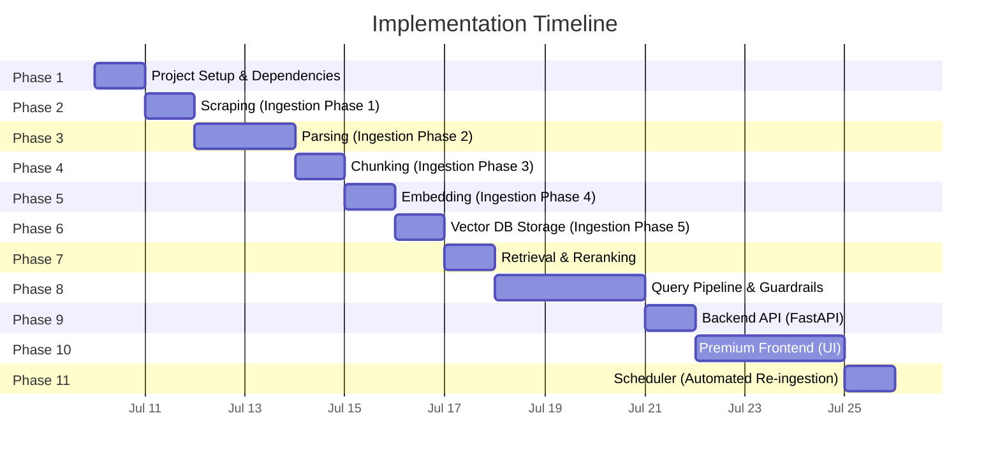
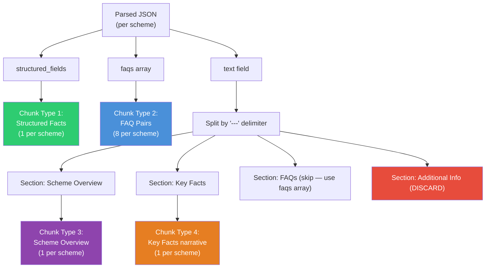
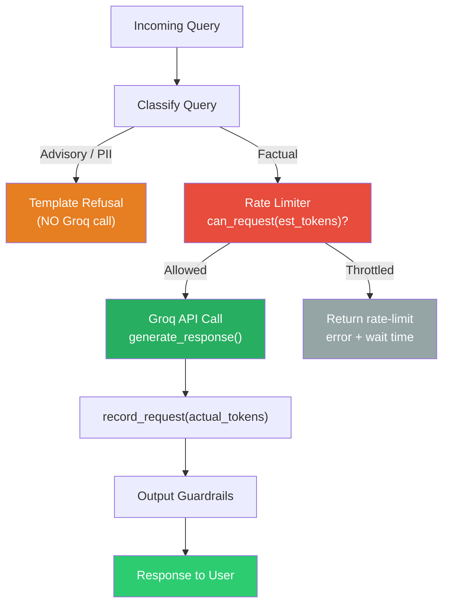
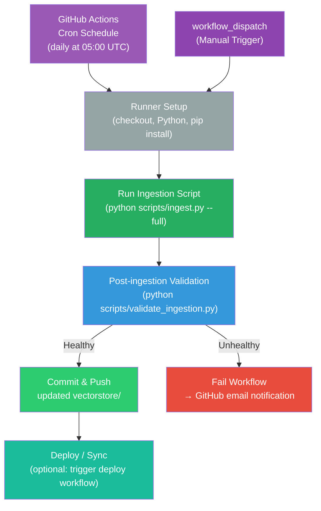
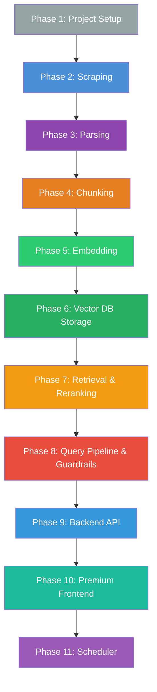

# Mutual Fund FAQ Assistant — Implementation Plan

## Overview

This document breaks the project into **11 implementation phases**, ordered by dependency. Each phase lists the files to create/modify, step-by-step tasks, acceptance criteria, and estimated effort.



---

## Phase 1 — Project Setup & Dependencies

> Bootstrap the project structure, install dependencies, and configure environment variables.

### Files to Create

| File | Purpose |
|------|---------|
| `requirements.txt` | All Python dependencies |
| `.env.example` | Template for API keys and config |
| `.gitignore` | Ignore vectorstore, `.env`, `__pycache__`, `data/raw/` |
| `README.md` | Initial skeleton with project description |
| `src/__init__.py` | Package init |
| `src/ingestion/__init__.py` | Ingestion sub-package |
| `src/pipeline/__init__.py` | Pipeline sub-package |
| `src/api/__init__.py` | API sub-package |
| `src/ui/__init__.py` | UI sub-package |
| `src/prompts/system_prompt.txt` | System prompt template |
| `src/prompts/refusal_prompt.txt` | Refusal prompt template |

### Tasks

- [ ] **1.1** Create the full directory structure as defined in [architecture.md → Section 8](file:///Users/iamprince/Desktop/Mutual%20Fund%20FAQ%20Assistant%20/docs/architecture.md):
  ```
  src/ingestion/, src/pipeline/, src/prompts/, src/api/, src/ui/
  data/raw/, data/processed/, data/chunks/
  vectorstore/, tests/, scripts/
  ```
- [ ] **1.2** Create `requirements.txt` with core dependencies:
  ```
  requests
  beautifulsoup4
  trafilatura
  langchain
  langchain-community
  chromadb
  sentence-transformers
  groq
  python-dotenv
  fastapi
  uvicorn
  streamlit
  ```
- [ ] **1.3** Create `.env.example` with placeholder keys:
  ```
  GROQ_API_KEY=your-groq-key-here
  EMBEDDING_MODEL=BAAI/bge-small-en-v1.5
  LLM_PROVIDER=groq
  GROQ_MODEL=llama-3.3-70b-versatile
  VECTOR_STORE_PATH=./vectorstore
  ```
- [ ] **1.4** Create `.gitignore` (vectorstore/, .env, __pycache__, data/raw/)
- [ ] **1.5** Write initial `README.md` skeleton
- [ ] **1.6** Write `src/prompts/system_prompt.txt` and `src/prompts/refusal_prompt.txt` from architecture templates
- [ ] **1.7** Install dependencies: `pip install -r requirements.txt`

### Acceptance Criteria

- [x] All directories exist
- [x] `pip install -r requirements.txt` succeeds
- [x] `.env.example` documents all required config
- [x] Prompt templates match architecture spec

---

## Phase 2 — Scraping (Data Ingestion — Phase 1)

> Fetch raw HTML from the 5 Groww scheme pages and save locally.

### Files to Create

| File | Purpose |
|------|---------|
| `src/ingestion/scraper.py` | Scraper module |
| `scripts/ingest.py` | Ingestion runner (Phase 2 only, extended later) |
| `tests/test_scraper.py` | Scraper unit tests |

### Tasks

- [ ] **2.1** Create `src/ingestion/scraper.py` with:
  - A `URLS` list containing the 5 Groww URLs:
    ```python
    URLS = [
        "https://groww.in/mutual-funds/hdfc-large-cap-fund-direct-growth",
        "https://groww.in/mutual-funds/hdfc-mid-cap-fund-direct-growth",
        "https://groww.in/mutual-funds/hdfc-small-cap-fund-direct-growth",
        "https://groww.in/mutual-funds/hdfc-gold-etf-fund-of-fund-direct-plan-growth",
        "https://groww.in/mutual-funds/hdfc-silver-etf-fof-direct-growth",
    ]
    ```
  - A `scrape_url(url: str) -> str` function that fetches HTML via `requests.get()` with proper headers (User-Agent)
  - A `scrape_all() -> list[dict]` function that iterates over `URLS`, fetches each, and saves raw HTML to `data/raw/<slug>.html`
  - Error handling: retry logic (max 3 retries), timeout (10s), logging
- [ ] **2.2** Create `scripts/ingest.py` that calls `scrape_all()` and prints a summary
- [ ] **2.3** Write `tests/test_scraper.py`:
  - Test URL list has 5 entries
  - Test `scrape_url` returns non-empty string for a mock/real URL
  - Test output files are created in `data/raw/`
- [ ] **2.4** Run scraper and verify 5 HTML files are saved to `data/raw/`

### Acceptance Criteria

- [x] 5 HTML files saved in `data/raw/` (one per scheme)
- [x] Each file is valid HTML (non-empty, contains `<html>` tag)
- [x] Scraper handles network errors gracefully with retries
- [x] `scripts/ingest.py` runs end-to-end without errors

---

## Phase 3 — Parsing (Data Ingestion — Phase 2)

> Extract clean, structured text and metadata from the raw HTML files.

### 2. FAQ Assistant Requirements
The assistant must:
- Answer facts-only queries, such as:
  - Expense ratio of a scheme
  - Exit load details
  - Minimum SIP amount
  - ELSS lock-in period
  - Riskometer classification
  - Benchmark index
  - Process to download statements or capital gains reports
- Ensure:
  - Each response is limited to a maximum of 3 sentences
  - Each response includes exactly one citation link
  - Each response includes a footer: "Last updated from sources: <date>"

### Files to Create

| File | Purpose |
|------|---------|
| `src/ingestion/parser.py` | HTML parser module |
| `tests/test_parser.py` | Parser unit tests |

### Tasks

- [ ] **3.1** Create `src/ingestion/parser.py` with:
  - A `parse_html(html_content: str, source_url: str) -> dict` function that:
    - Uses `BeautifulSoup` to strip scripts, styles, nav, footer, ads
    - Extracts clean body text
    - Extracts structured fields where possible (scheme name, expense ratio, exit load, SIP amount, benchmark, riskometer, etc.)
  - A `extract_metadata(source_url: str) -> dict` function that builds:
    ```python
    {
        "source_url": "https://groww.in/...",
        "scheme_name": "HDFC Large Cap Fund",
        "category": "Large Cap",
        "last_scraped_date": "2026-07-10"
    }
    ```
  - A `parse_all() -> list[dict]` function that reads all files from `data/raw/`, parses each, and saves results to `data/processed/<slug>.json`
- [ ] **3.2** Map URL slugs to scheme names and categories:
  ```python
  SCHEME_MAP = {
      "hdfc-large-cap-fund-direct-growth": ("HDFC Large Cap Fund", "Large Cap"),
      "hdfc-mid-cap-fund-direct-growth": ("HDFC Mid Cap Fund", "Mid Cap"),
      "hdfc-small-cap-fund-direct-growth": ("HDFC Small Cap Fund", "Small Cap"),
      "hdfc-gold-etf-fund-of-fund-direct-plan-growth": ("HDFC Gold ETF FoF", "Gold"),
      "hdfc-silver-etf-fof-direct-growth": ("HDFC Silver ETF FoF", "Silver"),
  }
  ```
- [ ] **3.3** Write `tests/test_parser.py`:
  - Test that parsed output contains non-empty `text` field
  - Test metadata fields are correctly populated
  - Test all 5 raw files produce valid parsed output
- [ ] **3.4** Update `scripts/ingest.py` to run Phase 1 → Phase 2 sequentially
- [ ] **3.5** Run parser and verify 5 JSON files in `data/processed/`

### Acceptance Criteria

- [x] 5 processed JSON files in `data/processed/`
- [x] Each JSON has `text` (clean content) and `metadata` (source_url, scheme_name, category, last_scraped_date)
- [x] No HTML tags, scripts, or boilerplate in the clean text
- [x] Scheme names and categories correctly mapped

---

## Phase 4 — Chunking (Data Ingestion — Phase 3)

> Create semantically meaningful chunks from the parsed JSON data, optimised for FAQ-style retrieval.

### Data Structure Analysis

Each parsed JSON in `data/processed/` contains **3 key fields**:

| Field | Content | Chunking Approach |
|-------|---------|-------------------|
| `structured_fields` | 15+ key-value pairs (expense ratio, NAV, AUM, exit load, benchmark, etc.) | **→ 1 structured-facts chunk per scheme** |
| `faqs` | 8 Q&A pairs per scheme | **→ 1 chunk per FAQ** (preserve Q+A integrity) |
| `text` | Full extracted text with `---` section delimiters | **→ Section-based chunks** (Overview, Key Facts only) |

> [!IMPORTANT]
> The `text` field contains an **"Additional Information"** section (~80% of the text) that is entirely Groww site navigation, other fund listings, stock/options tickers, and footer links. **This must be discarded** — it would pollute the vector store with irrelevant chunks.

### Chunking Strategy — 4 Chunk Types



**Expected chunk count:** ~11 chunks per scheme × 5 schemes = **~55 total chunks** (vs. 200+ noisy chunks with the generic splitter).

### Files to Create

| File | Purpose |
|------|---------|
| `src/ingestion/chunker.py` | Semantic chunking module |
| `tests/test_chunker.py` | Chunker unit tests |

### Tasks

- [ ] **4.1** Create `src/ingestion/chunker.py` with:

  - A `build_structured_facts_chunk(doc: dict) -> dict` function that:
    - Reads `structured_fields` and formats it into a natural-language paragraph:
      ```
      HDFC Large Cap Fund Direct Growth — Key Facts:
      Expense Ratio: 1.04%. Exit Load: Exit load of 1% if redeemed within 1 year.
      Min SIP: ₹100. Min Lumpsum: ₹100. NAV: ₹1227.566 (as of 09-Jul-2026).
      AUM: ₹39023.69 Cr. Riskometer: Moderately High. Benchmark: NIFTY 100 TRI.
      Lock-in: No lock-in period. Fund Manager: Prashant Jain. ISIN: INF179K01YV8.
      ```
    - Sets `chunk_type = "structured_facts"` in metadata

  - A `build_faq_chunks(doc: dict) -> list[dict]` function that:
    - Iterates over the `faqs` array
    - Creates **one chunk per FAQ** with the format:
      ```
      Q: What is the expense ratio of HDFC Large Cap Fund Direct Growth?
      A: The Expense Ratio of HDFC Large Cap Fund Direct Growth is 1.04% as of 10 Jul 2026.
      ```
    - Sets `chunk_type = "faq"` in metadata

  - A `build_section_chunks(doc: dict) -> list[dict]` function that:
    - Splits the `text` field on the `---` delimiter
    - Keeps only the **"Scheme Overview"** and **"Key Facts"** sections (indices 0 and 1)
    - **Discards** the "Frequently Asked Questions" section (already covered by `faqs` array)
    - **Discards** the "Additional Information" section (Groww navigation/boilerplate noise)
    - If a kept section exceeds 500 tokens, applies `RecursiveCharacterTextSplitter` as a fallback:
      ```python
      chunk_size = 500
      chunk_overlap = 50
      separators = ["\n\n", "\n", ". ", " "]
      ```
    - Sets `chunk_type = "section"` and `section_heading` in metadata

  - A `chunk_document(parsed_doc: dict) -> list[dict]` function that:
    - Calls all three builders above
    - Attaches parent metadata (`source_url`, `scheme_name`, `category`, `last_scraped_date`) to every chunk
    - Assigns a unique `chunk_id` per chunk: `{scheme_slug}_{chunk_type}_{index}`

  - A `chunk_all() -> list[dict]` function that reads from `data/processed/`, chunks each, and saves to `data/chunks/all_chunks.jsonl`

- [ ] **4.2** Write `tests/test_chunker.py`:
  - Test that structured-facts chunk contains key fields (expense_ratio, exit_load, nav, aum, benchmark)
  - Test each FAQ chunk contains both `Q:` and `A:` lines (no split Q&A pairs)
  - Test that "Additional Information" content (e.g., "Groww Arbitrage Fund", "NIFTY 50 Options", "IPO GMP") is **NOT** present in any chunk
  - Test metadata is preserved on every chunk (`source_url`, `scheme_name`, `category`, `chunk_type`)
  - Test total chunks per scheme is ~11 (1 structured + 8 FAQs + 2 sections)
  - Test total chunks across all 5 schemes is ~55
  - Test no chunk exceeds ~500 tokens
- [ ] **4.3** Update `scripts/ingest.py` to run Phase 1 → 2 → 3
- [ ] **4.4** Run chunker and inspect `data/chunks/all_chunks.jsonl`

### Acceptance Criteria

- [ ] `all_chunks.jsonl` exists with all chunks
- [ ] Each chunk has: `chunk_id`, `text`, `source_url`, `scheme_name`, `category`, `chunk_type`
- [ ] 4 chunk types present: `structured_facts`, `faq`, `section` (overview), `section` (key_facts)
- [ ] FAQ chunks preserve complete Q&A pairs (never split)
- [ ] No chunk contains Groww site boilerplate (navigation, stock tickers, footer links, other fund listings)
- [ ] Total chunk count is ~55 (not 200+)
- [ ] No chunk exceeds ~500 tokens

---

## Phase 5 — Embedding (Data Ingestion — Phase 4)

> Generate vector embeddings for all chunks using a sentence-transformer model.

### Embedding Model Selection

**Model:** `BAAI/bge-small-en-v1.5` (384-dim, ~130 MB)

| Decision Factor | Our Data Profile | Why BGE-small Wins |
|-----------------|------------------|--------------------|
| **Corpus size** | 55 chunks, ~18K total chars | Tiny corpus — no need for high-capacity model |
| **Chunk lengths** | FAQ: 29–132 words, Sections: 46–62 words, Facts: ~110 words | All well within BGE-small's 512-token context window |
| **Query style** | Simple factual: "What is the expense ratio of X?" | BGE-small excels at short factual similarity matching |
| **Vocabulary** | English financial terms, fund names, numbers | Fully covered by BGE-small's training data |
| **Latency** | User-facing FAQ bot needs fast responses | BGE-small is ~10x faster than BGE-large |
| **Memory** | May run on modest hardware | ~130 MB vs ~1.3 GB for BGE-large |

> [!NOTE]
> **Why not BGE-large?** With only 55 chunks of simple factual content and straightforward queries, the 1024-dimensional embeddings of BGE-large provide no retrieval quality gain. The additional latency (~3x slower) and memory (~10x larger) would be pure overhead. BGE-small's 384 dimensions are more than sufficient to distinguish between 55 chunks of mutual fund data.

### Embedding Strategy — Instruction-Prefixed

BGE models support **instruction prefixes** for queries to improve retrieval accuracy. We prepend a task description to the query (not to the documents) at query time:

```python
# At embedding time (documents) — NO prefix
doc_embedding = model.encode("Expense Ratio: 1.04%. Exit Load: ...")

# At query time — WITH prefix
query_embedding = model.encode(
    "Represent this sentence for searching relevant passages: "
    "What is the expense ratio of HDFC Large Cap Fund?"
)
```

### Files to Create

| File | Purpose |
|------|---------|
| `src/ingestion/embedder.py` | Embedding generation module |
| `tests/test_embedder.py` | Embedding unit tests |

### Tasks

- [ ] **5.1** Create `src/ingestion/embedder.py` with:
  - Load embedding model:
    ```python
    from sentence_transformers import SentenceTransformer
    model = SentenceTransformer("BAAI/bge-small-en-v1.5")
    ```
  - A `load_all_chunks() -> list[dict]` function that reads all per-scheme JSONL files from `data/chunks/*.jsonl`
  - A `embed_chunks(chunks: list[dict], batch_size: int = 32) -> list[dict]` function that:
    - Generates embeddings for the `text` field of each chunk (no instruction prefix for documents)
    - Processes in batches for efficiency
    - Returns chunks with an `embedding` field added (list of 384 floats)
  - A `embed_query(query: str) -> list[float]` function that:
    - Prepends the BGE instruction prefix: `"Represent this sentence for searching relevant passages: "`
    - Returns the 384-dim embedding vector
  - A `embed_all() -> list[dict]` orchestrator that loads chunks, embeds them, and returns chunks with embeddings
- [ ] **5.2** Write `tests/test_embedder.py`:
  - Test embedding produces vectors of expected dimension (384 for BGE-small)
  - Test all 55 chunks receive embeddings
  - Test query embedding includes instruction prefix and returns 384-dim vector
  - Test batch processing produces consistent results
- [ ] **5.3** Update `scripts/ingest.py` to add `--embed` flag for Phase 5

### Acceptance Criteria

- [ ] All 55 chunks have 384-dimensional embedding vectors
- [ ] `embed_query()` prepends instruction prefix for retrieval
- [ ] Batch embedding matches individual embedding results
- [ ] `scripts/ingest.py --embed` runs successfully

---

## Phase 6 — Vector DB Storage (Data Ingestion — Phase 5)

> Store embedded chunks in a ChromaDB vector database for similarity search.

### Chunk-Type-Aware Storage

ChromaDB metadata filters allow the retriever to optionally scope searches by chunk type:

| chunk_type | When to prioritise |
|------------|-------------------|
| `faq` | User asks a question matching a known FAQ pattern |
| `structured_facts` | User asks for a specific metric (NAV, AUM, expense ratio) |
| `section` | User asks a general overview question |

### Files to Create

| File | Purpose |
|------|---------|
| `src/ingestion/vectorstore.py` | ChromaDB storage and retrieval |
| `tests/test_vectorstore.py` | Vector store unit tests |

### Tasks

- [x] **6.1** Create `src/ingestion/vectorstore.py` with:
  - A `init_vectorstore(persist_dir: str = "vectorstore/") -> chromadb.Collection` function that:
    - Initialises ChromaDB persistent client at `vectorstore/`
    - Creates or gets a collection named `mutual_fund_faq`
  - A `store_chunks(chunks_with_embeddings: list[dict]) -> None` function that:
    - Stores embeddings with metadata: `source_url`, `scheme_name`, `category`, `chunk_id`, `chunk_type`, `section_heading`
    - Uses `chunk_id` as the document ID (enables upsert on re-run)
  - A `query_vectorstore(query_embedding: list[float], top_k: int = 5, filters: dict | None = None) -> list[dict]` function that:
    - Queries ChromaDB for top-K similar chunks
    - Supports optional metadata filters (`chunk_type`, `scheme_name`)
    - Returns chunks with similarity scores
  - A `build_vectorstore() -> None` orchestrator that:
    - Loads and embeds all chunks (via `embedder.embed_all()`)
    - Stores in ChromaDB
- [x] **6.2** Write `tests/test_vectorstore.py`:
  - Test ChromaDB collection is created and persisted
  - Test all 55 chunks are indexed in collection
  - Test query returns top-K results with metadata
  - Test metadata filters (`chunk_type`, `scheme_name`) narrow results correctly
  - Test a similarity query for "expense ratio" returns relevant chunks
  - Test a scheme-specific query returns chunks from that scheme only
- [x] **6.3** Update `scripts/ingest.py` to add `--vectorstore` flag and include Phase 5 + 6 in pipeline
- [x] **6.4** Run full ingestion and verify:
  - `vectorstore/` directory is populated
  - A test query like "What is the expense ratio?" returns relevant chunks
  - Metadata filters work correctly

### Acceptance Criteria

- [x] `vectorstore/` contains a persisted ChromaDB index
- [x] Collection `mutual_fund_faq` has all 55 chunks indexed
- [x] A test similarity search for "What is the expense ratio?" returns relevant chunks from the correct scheme
- [x] Metadata filters (`chunk_type`, `scheme_name`) narrow results correctly
- [x] Full `scripts/ingest.py` runs end-to-end (scrape → parse → chunk → embed → store)

---

## Phase 7 — Retrieval

> Implement similarity search over the vector store and add optional cross-encoder reranking.

### 7.1 Corpus & Embedding Profile (Verified)

Data profiling of the existing vector store reveals the following:

| Metric | Value |
|--------|-------|
| **Total chunks** | 55 (5 schemes × 11 chunks each) |
| **Chunk types** | `structured_facts` (5), `faq` (40), `section` (10) |
| **Text lengths** | 29–132 words (mean: 63, median: 61) |
| **Embedding model** | BAAI/bge-small-en-v1.5 |
| **Embedding dims** | 384, normalized (norm = 1.0) |
| **ChromaDB distance** | **L2 (squared Euclidean)** — default, no `hnsw:space` override |
| **Metadata per chunk** | `chunk_id`, `text`, `source_url`, `scheme_name`, `category`, `chunk_type`, `section_heading`, `last_scraped_date` |

> [!CAUTION]
> **Distance Metric Correction:** ChromaDB uses **L2 (squared Euclidean) distance** by default — NOT cosine distance. The collection was created with `metadata=None` (no `hnsw:space` override).
>
> For **normalized embeddings** (norm = 1.0), the correct conversion is:
> ```
> cosine_similarity = 1 - (L2_distance / 2)
> ```
> **NOT** `1 - distance`. Using the wrong formula produces negative "similarity" values for irrelevant queries and miscalibrated thresholds.

### 7.2 Empirical Distance Analysis

Tested 5 representative queries against the live vector store to calibrate the similarity threshold:

| Query | Best L2 Dist | True Cosine Sim | Top Chunk Type | Top Scheme | Relevant? |
|-------|-------------|-----------------|----------------|------------|-----------|
| "What is the expense ratio of HDFC Large Cap Fund?" | 0.2328 | **0.8836** | `faq` | HDFC Large Cap Fund | ✅ |
| "exit load HDFC Small Cap" | 0.5233 | **0.7384** | `structured_facts` | HDFC Small Cap Fund | ✅ |
| "minimum SIP amount" | 0.5318 | **0.4682** | `section` | HDFC Silver ETF FoF | ⚠️ Borderline |
| "What is the weather today?" | 1.2006 | **0.3997** | `faq` | HDFC Large Cap Fund | ❌ |
| "tell me about python programming" | 1.0945 | **0.4527** | `section` | HDFC Large Cap Fund | ❌ |

**Key observation:** Clear gap between relevant (sim ≥ 0.47) and irrelevant (sim ≤ 0.45) results. Scheme-specific queries with exact fund name match score 0.73+.

### 7.3 Similarity Threshold Decision

| Threshold | Effect |
|-----------|--------|
| 0.65 (original) | ❌ Too aggressive — would drop valid results like "minimum SIP amount" (0.47) |
| **0.55** (revised) | ✅ **Recommended** — keeps relevant results, filters irrelevant ones cleanly |
| 0.45 | ⚠️ Too permissive — would let through "python programming" (0.45) |

**Decision:** `SIMILARITY_THRESHOLD = 0.55` (cosine similarity) — provides a safety margin while cleanly separating mutual-fund queries from off-topic noise.

### 7.4 Deliverables

| Status | File | Description |
|--------|------|-------------|
| NEW | `src/retrieval/__init__.py` | Retrieval sub-package init |
| NEW | `src/retrieval/retriever.py` | Search interface wrapping vectorstore + embedder |
| NEW | `src/retrieval/reranker.py` | Optional cross-encoder reranking (placeholder) |
| NEW | `tests/test_retrieval.py` | Retrieval pipeline unit tests |

### 7.5 Retrieval Flow

```
User Query
  ↓
Embed query → query_embedding (384 dims, BGE local, instruction-prefixed)
  ↓
ChromaDB L2 search (top_k=5, optional scheme_name filter)
  ↓
Convert L2 distance → cosine similarity: sim = 1 - (dist / 2)
  ↓
Filter by SIMILARITY_THRESHOLD (0.55)
  ↓
Rerank (optional, default OFF) → top 3 chunks
  ↓
Return chunks + metadata + similarity scores to generation pipeline
```


### Tasks

- [x] **7.1** Create `src/retrieval/__init__.py` (package init)
- [x] **7.2** Create `src/retrieval/retriever.py` with:
  - A `search(query: str, top_k: int = 5, scheme_name: str | None = None) -> list[dict]` function that:
    - Embeds the query using `embedder.embed_query()` (384 dims, BGE-small with instruction prefix)
    - Calls `vectorstore.query_vectorstore()` with the query embedding and optional `scheme_name` filter
    - Converts ChromaDB L2 distance to cosine similarity: `similarity = 1 - (distance / 2)`
    - Filters results by `SIMILARITY_THRESHOLD` (default: `0.55`)
    - If `RERANKER_ENABLED`, passes filtered chunks to `reranker.rerank()`
    - Returns filtered chunks with similarity scores and full metadata
  - Config constants:
    ```python
    SIMILARITY_THRESHOLD = 0.55   # Cosine sim floor (calibrated from empirical testing)
    DEFAULT_TOP_K = 5             # Chunks to retrieve from ChromaDB before filtering
    RERANKER_ENABLED = False      # Toggle cross-encoder reranking
    RERANKER_TOP_K = 3            # Chunks to return after reranking
    ```
- [x] **7.3** Create `src/retrieval/reranker.py` — optional cross-encoder reranking (placeholder):
  - A `rerank(query: str, chunks: list[dict], top_k: int = 3) -> list[dict]` function that:
    - **Currently:** Passthrough placeholder — returns the top `top_k` chunks sorted by existing similarity score
    - **Contains commented-out cross-encoder implementation for future activation:**
      ```python
      # Future: CrossEncoder("cross-encoder/ms-marco-MiniLM-L-6-v2")
      # Score each (query, chunk.text) pair → re-sort → return top_k
      ```
  - Toggled via `RERANKER_ENABLED` in config (default: `False`)
- [x] **7.4** Write `tests/test_retrieval.py`:
  - Test `search()` returns results for a known factual query (e.g., "expense ratio HDFC Large Cap")
  - Test results have required fields: `chunk_id`, `text`, `similarity`, `scheme_name`, `source_url`
  - Test L2-to-cosine conversion is correct (`sim = 1 - dist/2`)
  - Test `SIMILARITY_THRESHOLD` filtering removes low-similarity chunks (e.g., "weather" query returns empty)
  - Test `scheme_name` filter narrows results to a single scheme
  - Test reranker passthrough returns top-3 sorted by similarity
  - Test reranker toggle (`RERANKER_ENABLED = False`) skips reranking
- [x] **7.5** Verify retrieval quality with test queries:
  - "What is the expense ratio of HDFC Large Cap?" → `faq` chunk from HDFC Large Cap (sim ≈ 0.88)
  - "exit load HDFC Small Cap" → `structured_facts` from HDFC Small Cap (sim ≈ 0.74)
  - "minimum SIP amount" → `section` chunks from multiple schemes (sim ≈ 0.47 — borderline)
  - "What is the weather today?" → **empty result** (sim ≈ 0.40, below threshold)

### 7.6 Reranker (`reranker.py`) — Optional

Currently a **passthrough placeholder** that returns top-k by existing similarity score. Contains commented-out cross-encoder implementation for future activation:

```python
# Future: CrossEncoder("cross-encoder/ms-marco-MiniLM-L-6-v2")
# Score each (query, chunk.text) pair → re-sort → return top_k
```

Toggled via `RERANKER_ENABLED` in config (default: `False`).

### Acceptance Criteria

- [x] `src/retrieval/retriever.py` wraps vectorstore with correct L2→cosine conversion and threshold filtering
- [x] `src/retrieval/reranker.py` exists as a passthrough placeholder with commented-out cross-encoder code
- [x] `SIMILARITY_THRESHOLD = 0.55` filters out irrelevant queries (weather, programming → empty result)
- [x] `RERANKER_ENABLED = False` by default (passthrough mode)
- [x] Relevant factual queries (expense ratio, exit load) return correct chunks with sim ≥ 0.55
- [x] Scheme-specific queries correctly filter by `scheme_name`
- [x] All tests in `tests/test_retrieval.py` pass

---

## Phase 8 — Query Pipeline, Guardrails & Rate Limiting

> Build the runtime pipeline: query classification, retrieval, LLM generation, safety guardrails, and **Groq API rate limiting**.

### Groq Free-Tier Limits (`llama-3.3-70b-versatile`)

The Groq free tier imposes strict rate limits that must be enforced client-side to avoid `429 Too Many Requests` errors:

| Limit | Value | Enforcement |
|-------|-------|-------------|
| **Requests per minute (RPM)** | 30 | Sliding window (60s) |
| **Requests per day (RPD)** | 1,000 | Daily counter (UTC midnight reset) |
| **Tokens per minute (TPM)** | 12,000 | Sliding window (60s) |
| **Tokens per day (TPD)** | 100,000 | Daily counter (UTC midnight reset) |

> [!CAUTION]
> With a 12K TPM limit and ~800–1200 tokens per RAG request (system prompt + context chunks + query + response), we can sustain **~10–15 requests/minute** before hitting the token ceiling — well below the 30 RPM request limit. **TPM is the binding constraint**, not RPM.

### Rate-Limiting Strategy



**Key design decisions:**
1. **Advisory/PII queries skip Groq entirely** — template-based refusals conserve rate budget
2. **Pre-flight token estimation** before each Groq call (heuristic: `len(text) / 4`)
3. **Post-flight accounting** using actual token counts from Groq response metadata
4. **Graceful degradation** — rate-limited users get a friendly message with estimated wait time

### Files to Create

| File | Purpose |
|------|---------|
| `src/pipeline/rate_limiter.py` | **Thread-safe Groq rate limiter (RPM/RPD/TPM/TPD)** |
| `src/pipeline/query_classifier.py` | Factual vs. advisory classifier |
| `src/pipeline/retriever.py` | Vector similarity search (delegates to `src/retrieval/`) |
| `src/pipeline/generator.py` | LLM response generation (rate-limit aware) |
| `src/pipeline/guardrails.py` | Input/output safety checks |
| `tests/test_rate_limiter.py` | Rate limiter unit tests |
| `tests/test_classifier.py` | Classifier tests |
| `tests/test_retriever.py` | Retriever tests |
| `tests/test_guardrails.py` | Guardrail tests |
| `tests/test_e2e.py` | End-to-end pipeline tests |

### Tasks

#### 8A — Query Classifier (`query_classifier.py`)

- [ ] **8.1** Implement keyword blocklist:
  ```python
  ADVISORY_KEYWORDS = ["should I", "which is better", "recommend", "suggest",
                        "advise", "good fund", "best fund", "invest in"]
  ```
- [ ] **8.2** Implement regex intent patterns for advisory queries
- [ ] ~~**8.3** Add LLM-based fallback classifier for ambiguous queries~~
  > **Skipped** — LLM classification would consume Groq rate budget (1 extra API call per query). The keyword + regex approach covers known query patterns. Can be added later if edge cases warrant it.
- [ ] **8.4** Expose `classify(query: str) -> str` returning `"factual"` | `"advisory"` | `"pii_detected"`
- [ ] **8.5** Write `tests/test_classifier.py`:
  - "What is the expense ratio of HDFC Large Cap?" → `factual`
  - "Should I invest in HDFC Mid Cap Fund?" → `advisory`
  - "My PAN is ABCDE1234F" → `pii_detected`

#### 8B — Guardrails (`guardrails.py`)

- [ ] **8.6** Implement input guardrails:
  - PII detection via regex (PAN: `[A-Z]{5}[0-9]{4}[A-Z]`, Aadhaar: `\d{4}\s?\d{4}\s?\d{4}`, phone, email)
  - Query length cap (500 chars)
  - Prompt injection stripping
- [ ] **8.7** Implement output guardrails:
  - Response sentence count check (≤ 3)
  - Citation URL presence check (exactly 1)
  - Advisory language scan in output
  - PII leak scan
  - Footer enforcement (`"Last updated from sources: <date>"`)
- [ ] **8.8** Write `tests/test_guardrails.py`:
  - Test PII detection catches PAN, Aadhaar, email, phone
  - Test output length enforcement
  - Test citation check passes/fails correctly

#### 8C — Retriever (`retriever.py`)

- [ ] **8.9** Implement `retrieve(query: str, top_k: int = 5) -> list[dict]`:
  - Delegates to `src/retrieval/vector_store.search()` (Phase 7)
  - Applies reranker via `src/retrieval/reranker.rerank()` if `RERANKER_ENABLED` is `True`
  - Returns final top-3 chunks with metadata to the generation pipeline
- [ ] **8.10** Write `tests/test_retriever.py`:
  - Test retrieval returns K results
  - Test results contain expected metadata fields
  - Test scheme-specific queries return chunks from the correct scheme
  - Test integration with Phase 7 retrieval + reranker pipeline

#### 8D — Generator (`generator.py`) — Rate-Limit Aware

- [ ] **8.11** Implement `generate_response(query: str, context_chunks: list[dict]) -> dict`:
  - Load system prompt from `src/prompts/system_prompt.txt`
  - Format prompt with retrieved chunks and user query
  - **Pre-flight rate check:** estimate tokens for full prompt (system + context + query), call `rate_limiter.can_request(estimated_tokens)` — if throttled, return rate-limit error with wait time
  - Call Groq API (`llama-3.3-70b-versatile`) with `temperature=0.1`, `max_tokens=300`
  - **Post-flight accounting:** extract actual `usage.total_tokens` from Groq response, call `rate_limiter.record_request(tokens_used)`
  - Return structured response: `{ answer, source, last_updated, query_type }`
- [ ] **8.12** Implement `generate_refusal(query: str) -> dict`:
  - **Template-based** (NO Groq API call) — conserves rate budget
  - Returns fixed polite refusal message + AMFI educational link
  - Format: `{ answer: "I can only provide factual information...", source: "https://www.amfiindia.com/...", query_type: "advisory" }`
- [ ] **8.13** Apply output guardrails to generated response before returning
- [ ] **8.14** Write `tests/test_e2e.py`:
  - Factual query → response with ≤ 3 sentences, 1 citation, footer
  - Advisory query → polite refusal with educational link (no API call)
  - PII query → blocked response (no API call)
  - Rate-limited query → graceful error with wait time

#### 8E — Rate Limiter (`rate_limiter.py`)

- [ ] **8.15** Implement `GroqRateLimiter` class with sliding-window and daily counters:
  ```python
  class GroqRateLimiter:
      # Groq free-tier limits for llama-3.3-70b-versatile
      RPM_LIMIT = 30        # requests per minute
      RPD_LIMIT = 1_000     # requests per day
      TPM_LIMIT = 12_000    # tokens per minute
      TPD_LIMIT = 100_000   # tokens per day

      def can_request(self, estimated_tokens: int) -> tuple[bool, float]:
          """Pre-flight check. Returns (allowed, wait_seconds)."""

      def record_request(self, tokens_used: int) -> None:
          """Post-flight: record actual token usage from Groq response."""

      def estimate_tokens(self, text: str) -> int:
          """Heuristic: len(text) / 4."""

      def get_status(self) -> dict:
          """Current usage stats for monitoring/debugging."""
  ```
- [ ] **8.16** Sliding-window implementation for per-minute limits:
  - Maintain a `deque` of `(timestamp, token_count)` tuples
  - On each check, evict entries older than 60 seconds
  - Sum remaining entries to check against RPM / TPM limits
- [ ] **8.17** Daily counter implementation:
  - Track `daily_request_count` and `daily_token_count`
  - Store `current_day` (UTC date) — reset counters when date changes
- [ ] **8.18** Graceful throttling:
  - When throttled by RPM/TPM, calculate `wait_seconds` until the oldest entry expires
  - When throttled by RPD/TPD, calculate `wait_seconds` until UTC midnight
  - Return user-friendly message: `"Rate limit reached. Please try again in {wait} seconds."`
- [ ] **8.19** Thread safety: use `threading.Lock` for all counter mutations
- [ ] **8.20** Write `tests/test_rate_limiter.py`:
  - Test RPM enforcement (31st request within 60s is blocked)
  - Test TPM enforcement (exceeding 12K tokens/minute is blocked)
  - Test RPD enforcement (1001st request in a day is blocked)
  - Test TPD enforcement (exceeding 100K tokens/day is blocked)
  - Test sliding window expiry (requests become available after 60s)
  - Test daily reset (counters reset on date change)
  - Test `estimate_tokens()` returns reasonable values
  - Test `get_status()` returns correct usage breakdown
  - Test thread safety under concurrent access

### Acceptance Criteria

- [ ] Classifier correctly routes factual, advisory, and PII queries
- [ ] Retriever returns relevant chunks from the vector store
- [ ] Generator produces constrained responses (≤ 3 sentences, 1 citation, footer)
- [ ] Refusal handler returns polite **template-based** refusal with AMFI/SEBI link (no Groq call)
- [ ] All guardrails pass their test cases
- [ ] End-to-end test covers all three query types + rate-limit scenario
- [ ] Rate limiter enforces all 4 Groq limits (RPM, RPD, TPM, TPD)
- [ ] Rate limiter uses sliding window for per-minute and daily counters for per-day
- [ ] Rate-limited requests return a friendly message with estimated wait time (no crash/500)
- [ ] Generator checks `can_request()` before and `record_request()` after every Groq call

---

## Phase 9 — Backend API (FastAPI)

> Build the FastAPI backend that exposes the query pipeline as a REST API.

### Files to Create

| File | Purpose |
|------|---------|
| `src/api/main.py` | FastAPI application with `/ask` and `/health` endpoints |
| `src/api/models.py` | Pydantic request/response models |
| `scripts/evaluate.py` | Response quality evaluation script |

### Tasks

#### 9A — FastAPI Backend (`src/api/main.py`)

- [ ] **9.1** Create FastAPI app with CORS middleware (allow all origins for local dev)
- [ ] **9.2** Implement `POST /ask` endpoint:
  ```python
  @app.post("/ask")
  async def ask(request: QueryRequest) -> QueryResponse:
      # 1. Input guardrails (PII check, length cap, injection strip)
      # 2. Classify query (factual / advisory / pii_detected)
      # 3. If advisory → generate_refusal() (no Groq call)
      # 4. If pii_detected → generate_pii_block() (no Groq call)
      # 5. If factual → retrieve() → generate_response() (rate-limited Groq call)
      # 6. Return structured response
  ```
- [ ] **9.3** Implement `GET /health` endpoint:
  ```python
  @app.get("/health")
  async def health():
      return { "status": "healthy", "model": GROQ_MODEL }
  ```
- [ ] **9.4** Implement `GET /rate-limit-status` endpoint:
  ```python
  @app.get("/rate-limit-status")
  async def rate_limit_status():
      return rate_limiter.get_status()
  ```
- [ ] **9.5** Create `src/api/models.py` with Pydantic models:
  ```python
  class QueryRequest(BaseModel):
      query: str

  class QueryResponse(BaseModel):
      status: str        # "success" | "refused" | "blocked" | "rate_limited" | "error"
      answer: str
      source: str | None
      last_updated: str | None
      query_type: str    # "factual" | "advisory" | "pii_detected"
  ```
- [ ] **9.6** Test API with `curl` / Swagger UI (`/docs`)

#### 9B — Evaluation & Documentation

- [ ] **9.7** Create `scripts/evaluate.py`:
  - Run a set of 10–15 test queries (mix of factual, advisory, PII)
  - Validate response format (sentence count, citation, footer)
  - Print pass/fail summary
- [ ] **9.8** Update `README.md` with:
  - Setup instructions (`pip install`, `.env` config)
  - How to run ingestion (`python scripts/ingest.py`)
  - How to start the API (`uvicorn src.api.main:app`)
  - How to launch the UI (Phase 10)
  - Selected AMC and schemes table
  - Architecture overview
  - Known limitations & disclaimer

### Acceptance Criteria

- [ ] `POST /ask` returns correct JSON for factual, advisory, and PII queries
- [ ] `GET /health` returns healthy status
- [ ] `GET /rate-limit-status` returns current usage across all 4 limit dimensions
- [ ] Swagger UI at `/docs` works
- [ ] `scripts/evaluate.py` passes all test queries
- [ ] `README.md` is complete and accurate

---

## Phase 10 — Premium Frontend (UI)

> Build a high-quality, visually stunning chat interface that connects to the FastAPI backend.

### Design Vision

The frontend should look and feel like a **premium financial assistant** — not a basic prototype. Think Bloomberg Terminal meets modern chat AI, with a dark theme and glass-like aesthetics.

### Design System

#### Color Palette

| Token | Value | Usage |
|-------|-------|-------|
| `--bg-primary` | `#0a0e1a` | Page background (deep navy-black) |
| `--bg-secondary` | `#111827` | Card / panel background |
| `--bg-chat` | `#1a1f2e` | Chat message area |
| `--glass` | `rgba(255, 255, 255, 0.05)` | Glassmorphism panels |
| `--glass-border` | `rgba(255, 255, 255, 0.08)` | Glass panel borders |
| `--accent-primary` | `#6366f1` | Primary actions, links (Indigo-500) |
| `--accent-gradient` | `linear-gradient(135deg, #6366f1, #8b5cf6)` | Buttons, active states |
| `--text-primary` | `#f1f5f9` | Main text (Slate-100) |
| `--text-secondary` | `#94a3b8` | Secondary text (Slate-400) |
| `--text-muted` | `#64748b` | Timestamps, captions (Slate-500) |
| `--success` | `#10b981` | Success states, citation badges |
| `--warning` | `#f59e0b` | Refusal indicators |
| `--danger` | `#ef4444` | PII block, errors |

#### Typography

| Element | Font | Weight | Size |
|---------|------|--------|------|
| Headings | Inter | 700 | 1.5rem – 2rem |
| Body text | Inter | 400 | 0.95rem |
| Code / data | JetBrains Mono | 400 | 0.85rem |
| Captions | Inter | 300 | 0.8rem |

### UI Layout

```
┌─────────────────────────────────────────────────────────────────┐
│  🏦  HDFC Mutual Fund FAQ Assistant          [Rate Status]  ⚙  │  ← Header (glass)
├─────────────────────────────────────────────────────────────────┤
│                                                                 │
│  ┌─────────────────────────────────────────────────────────┐   │
│  │  💬 Welcome! I can help you with factual information    │   │  ← Welcome card
│  │  about HDFC mutual fund schemes.                        │   │
│  │  ⚠️ Facts only. No investment advice.                   │   │
│  └─────────────────────────────────────────────────────────┘   │
│                                                                 │
│  ┌───────────────┐ ┌───────────────┐ ┌───────────────┐         │
│  │ Expense ratio │ │ Exit load for │ │ Min SIP for   │         │  ← Quick-ask chips
│  │ HDFC Large Cap│ │ HDFC Small Cap│ │ HDFC Mid Cap  │         │
│  └───────────────┘ └───────────────┘ └───────────────┘         │
│                                                                 │
│  ┌─────────────────────────────────────────────────────────┐   │
│  │  User:  What is the expense ratio of HDFC Large Cap?   │   │  ← User message
│  └─────────────────────────────────────────────────────────┘   │
│  ┌─────────────────────────────────────────────────────────┐   │
│  │  🤖 Bot:  The expense ratio of HDFC Large Cap Fund     │   │  ← Bot response
│  │  Direct Growth is 1.04% as of Jul 2026.                │   │
│  │                                                         │   │
│  │  📎 Source: groww.in/...  │  🕐 Updated: Jul 2026      │   │  ← Citation footer
│  └─────────────────────────────────────────────────────────┘   │
│                                                                 │
│  ┌─────────────────────────────────────────────────────────┐   │
│  │  ✍️  Ask about any HDFC mutual fund scheme...    [Send] │   │  ← Input bar (glass)
│  └─────────────────────────────────────────────────────────┘   │
└─────────────────────────────────────────────────────────────────┘
```

### Files to Create

| File | Purpose |
|------|---------|
| `src/ui/index.html` | Main HTML page (single-page app) |
| `src/ui/styles.css` | Complete CSS with design system, animations, responsive layout |
| `src/ui/app.js` | JavaScript: chat logic, API calls, DOM manipulation, animations |
| `src/ui/assets/` | Any static assets (logo, icons — optional) |

### Tasks

#### 10A — HTML Structure (`src/ui/index.html`)

- [ ] **10.1** Create semantic HTML5 structure:
  - `<header>` — App title, logo, rate-limit status indicator
  - `<main>` — Chat message area (scrollable)
  - `<footer>` — Input bar with send button
- [ ] **10.2** Include Google Fonts (Inter, JetBrains Mono)
- [ ] **10.3** Include meta tags for SEO and responsiveness
- [ ] **10.4** Add disclaimer banner below header

#### 10B — CSS Design System (`src/ui/styles.css`)

- [ ] **10.5** Implement CSS custom properties (design tokens from color palette above)
- [ ] **10.6** Dark theme with glassmorphism:
  - Glass panels: `backdrop-filter: blur(12px)`, semi-transparent backgrounds
  - Subtle borders: `1px solid var(--glass-border)`
  - Ambient glow effects on focus states
- [ ] **10.7** Chat message styling:
  - User messages: right-aligned, gradient accent background
  - Bot messages: left-aligned, glass panel with subtle border
  - Refusal messages: warning-colored accent (amber)
  - PII block messages: danger-colored accent (red)
  - Typing indicator: animated three-dot pulse
- [ ] **10.8** Quick-ask chip buttons:
  - Pill-shaped, glass background
  - Hover: scale + glow effect
  - Click: ripple animation
- [ ] **10.9** Input bar:
  - Full-width glass panel at bottom
  - Textarea with auto-resize
  - Send button with gradient + hover animation
  - Character count indicator (approaching 500 limit)
- [ ] **10.10** Micro-animations:
  - Message fade-in slide-up on appear
  - Typing indicator bounce animation
  - Send button pulse on hover
  - Smooth scroll to latest message
  - Quick-ask chips stagger animation on load
- [ ] **10.11** Responsive design:
  - Mobile-first layout (320px+)
  - Tablet breakpoint (768px)
  - Desktop max-width container (800px, centered)
  - Touch-friendly tap targets (44px minimum)

#### 10C — JavaScript Logic (`src/ui/app.js`)

- [ ] **10.12** Chat state management:
  - Message history array: `[{ role, content, status, source, timestamp }]`
  - Render messages dynamically to DOM
- [ ] **10.13** API integration:
  - `async function sendQuery(query)` → `POST /ask` to FastAPI backend
  - Handle all response statuses: `success`, `refused`, `blocked`, `rate_limited`, `error`
  - Show typing indicator while awaiting response
  - Graceful error handling with user-friendly messages
- [ ] **10.14** Quick-ask chips:
  - 3 pre-defined example queries as clickable chips
  - On click: populate input → send → display response
  - Chips fade out after first user message (or stay visible — user preference)
- [ ] **10.15** Input handling:
  - Submit on Enter (Shift+Enter for newline)
  - Disable send button while request is in flight
  - Clear input after successful send
  - Character count warning at 450+ characters
- [ ] **10.16** Citation display:
  - Extract citation URL from response
  - Render as a clickable badge/pill below the answer
  - Show "Last updated" timestamp
- [ ] **10.17** Rate-limit status display:
  - Fetch `GET /rate-limit-status` periodically (every 30s)
  - Show a subtle indicator in the header (e.g., "28/30 RPM remaining")
  - Change color when approaching limits (green → amber → red)
- [ ] **10.18** Keyboard shortcuts:
  - `Enter` — Send message
  - `Shift+Enter` — New line
  - `Escape` — Clear input

#### 10D — Serving & Integration

- [ ] **10.19** Serve the frontend via FastAPI's `StaticFiles` mount:
  ```python
  from fastapi.staticfiles import StaticFiles
  app.mount("/", StaticFiles(directory="src/ui", html=True), name="ui")
  ```
- [ ] **10.20** Ensure CORS is configured so the frontend can call `/ask` and `/rate-limit-status`
- [ ] **10.21** Test full flow: open browser → type query → see response with citation

### Acceptance Criteria

- [ ] Frontend loads at `http://localhost:8000/` with the dark-themed chat UI
- [ ] Welcome message and disclaimer are visible on first load
- [ ] 3 quick-ask chip buttons work and trigger responses
- [ ] User messages appear right-aligned with accent gradient
- [ ] Bot responses appear left-aligned with glass panel styling
- [ ] Typing indicator shows while awaiting Groq response
- [ ] Citation URL renders as a clickable link below the response
- [ ] "Last updated" footer is present on every factual response
- [ ] Advisory refusals show with amber/warning styling
- [ ] PII blocks show with red/danger styling
- [ ] Rate-limited responses show with a friendly wait message
- [ ] Rate-limit status indicator updates in the header
- [ ] Micro-animations are smooth (message fade-in, chip hover, send pulse)
- [ ] Responsive: works on mobile (320px), tablet (768px), desktop (1200px+)
- [ ] No console errors, clean JavaScript
- [ ] Full flow: `uvicorn src.api.main:app` → open browser → ask question → get answer

---

## Phase 11 — Scheduler (GitHub Actions — Automated Daily Re-ingestion)

> Automate the data ingestion pipeline using **GitHub Actions** so the vector store is refreshed daily with the latest mutual fund data from Groww — no in-process scheduler needed.

### Why GitHub Actions?

Mutual fund data (NAV, AUM, expense ratios, exit loads) changes daily. Without automated re-ingestion, the FAQ assistant serves stale answers. **GitHub Actions** provides a fully managed, zero-infra cron scheduler that:

- Runs on GitHub's hosted runners — no server uptime dependency
- Has native cron scheduling (`schedule` trigger), concurrency controls, and secret management
- Provides built-in logging, run history, email failure notifications, and manual `workflow_dispatch` triggers
- Decouples the scheduler from the application process — the FastAPI app stays lightweight

### Scheduler Architecture



### Scheduler Strategy

| Decision | Choice | Rationale |
|----------|--------|-----------|
| **Platform** | GitHub Actions | Free for public repos (2,000 min/month for private), zero infra, built-in cron, secrets, and notifications |
| **Schedule** | Daily at 05:00 UTC (10:30 AM IST) | Before Indian market hours; data is typically updated overnight on Groww |
| **Trigger types** | `schedule` (cron) + `workflow_dispatch` (manual) | Automated daily runs + on-demand manual trigger from GitHub UI |
| **Concurrency guard** | `concurrency` group with `cancel-in-progress: false` | Prevents overlapping ingestion runs; queues instead of cancelling |
| **Secrets** | GitHub repo Secrets (`GROQ_API_KEY`) | Secure — never committed to code; injected as environment variables at runtime |
| **Artifact persistence** | Commit updated `vectorstore/` back to repo | Ensures the deployed app always uses the latest index |
| **Failure alerting** | GitHub's built-in email notifications on workflow failure | Automatic — no extra webhook/email setup needed |

### Files to Create

| File | Purpose |
|------|---------|
| `.github/workflows/daily-ingestion.yml` | GitHub Actions workflow — daily cron + manual trigger for full ingestion pipeline |
| `.github/workflows/staleness-check.yml` | GitHub Actions workflow — every 6 hours, checks if data is stale (>36h) |
| `scripts/validate_ingestion.py` | Post-ingestion validation script (chunk count, date freshness check) |
| `scripts/check_staleness.py` | Data staleness checker (reads vector store metadata, exits non-zero if stale) |

### Tasks

#### 11A — Daily Ingestion Workflow (`.github/workflows/daily-ingestion.yml`)

- [ ] **11.1** Create `.github/workflows/daily-ingestion.yml` with:
  ```yaml
  name: Daily Data Ingestion

  on:
    schedule:
      - cron: '0 5 * * *'  # 05:00 UTC daily (10:30 AM IST)
    workflow_dispatch:       # Manual trigger from GitHub UI
      inputs:
        force_rescrape:
          description: 'Force re-scrape even if data exists'
          required: false
          default: 'false'
          type: boolean

  concurrency:
    group: ingestion-pipeline
    cancel-in-progress: false  # Queue, don't cancel — ingestion must complete

  permissions:
    contents: write  # Needed to push updated vectorstore

  jobs:
    ingest:
      runs-on: ubuntu-latest
      timeout-minutes: 30

      steps:
        - name: Checkout repository
          uses: actions/checkout@v4

        - name: Set up Python 3.11
          uses: actions/setup-python@v5
          with:
            python-version: '3.11'
            cache: 'pip'

        - name: Install dependencies
          run: pip install -r requirements.txt

        - name: Run full ingestion pipeline
          env:
            GROQ_API_KEY: ${{ secrets.GROQ_API_KEY }}
          run: python scripts/ingest.py --full

        - name: Validate ingestion results
          run: python scripts/validate_ingestion.py

        - name: Commit updated vectorstore
          run: |
            git config user.name "github-actions[bot]"
            git config user.email "github-actions[bot]@users.noreply.github.com"
            git add vectorstore/ data/
            git diff --cached --quiet || git commit -m "chore: daily data re-ingestion $(date -u +'%Y-%m-%d %H:%M UTC')"
            git push
  ```

- [ ] **11.2** Configure GitHub repo Secrets:
  - `GROQ_API_KEY` — Groq API key for embedding model (if needed at ingestion time)
  - Any other secrets from `.env` that the ingestion pipeline requires

- [ ] **11.3** Set `timeout-minutes: 30` to prevent runaway jobs (ingestion typically takes ~5 min)

#### 11B — Staleness Check Workflow (`.github/workflows/staleness-check.yml`)

- [ ] **11.4** Create `.github/workflows/staleness-check.yml` with:
  ```yaml
  name: Data Staleness Check

  on:
    schedule:
      - cron: '0 */6 * * *'  # Every 6 hours
    workflow_dispatch:         # Manual trigger

  jobs:
    check-staleness:
      runs-on: ubuntu-latest
      timeout-minutes: 5

      steps:
        - name: Checkout repository
          uses: actions/checkout@v4

        - name: Set up Python 3.11
          uses: actions/setup-python@v5
          with:
            python-version: '3.11'
            cache: 'pip'

        - name: Install dependencies
          run: pip install -r requirements.txt

        - name: Check data staleness
          run: python scripts/check_staleness.py --threshold-hours 36
  ```

- [ ] **11.5** The staleness check script exits with code 1 if data is stale (>36 hours) — this **fails the workflow** and triggers GitHub's email notification to repo admins.

#### 11C — Validation Script (`scripts/validate_ingestion.py`)

- [ ] **11.6** Create `scripts/validate_ingestion.py` with:
  - Load the ChromaDB vector store from `vectorstore/`
  - Check chunk count (expected: ~55, fail if <40 or >80)
  - Verify `last_scraped_date` on chunks matches today's date (UTC)
  - Print a summary report to stdout (captured in GitHub Actions logs)
  - Exit with code 0 on success, code 1 on failure (fails the workflow step)
  ```python
  import sys
  from datetime import date, datetime

  def validate():
      """Post-ingestion validation — exits non-zero on failure."""
      from src.ingestion.vectorstore import init_vectorstore

      collection = init_vectorstore()
      count = collection.count()

      print(f"✅ Chunk count: {count}")
      if count < 40 or count > 80:
          print(f"❌ FAIL: Expected ~55 chunks, got {count}")
          sys.exit(1)

      # Check freshness — at least one chunk should have today's date
      results = collection.get(limit=1, include=["metadatas"])
      if results["metadatas"]:
          last_date = results["metadatas"][0].get("last_scraped_date", "unknown")
          today = date.today().isoformat()
          print(f"✅ Latest scraped date: {last_date}")
          if last_date != today:
              print(f"⚠️  WARNING: Data date ({last_date}) != today ({today})")
      
      print("✅ Validation PASSED")
      sys.exit(0)

  if __name__ == "__main__":
      validate()
  ```

#### 11D — Staleness Check Script (`scripts/check_staleness.py`)

- [ ] **11.7** Create `scripts/check_staleness.py` with:
  - Accept `--threshold-hours` CLI argument (default: 36)
  - Read the most recent `last_scraped_date` from vector store metadata
  - Calculate hours since last ingestion
  - Print staleness report to stdout
  - Exit with code 0 if fresh, code 1 if stale (triggers GitHub notification)
  ```python
  import sys
  import argparse
  from datetime import datetime, timezone

  def check_staleness(threshold_hours: int = 36):
      """Check if vector store data is stale. Exits non-zero if stale."""
      from src.ingestion.vectorstore import init_vectorstore

      collection = init_vectorstore()
      results = collection.get(limit=1, include=["metadatas"])

      if not results["metadatas"]:
          print("❌ STALE: No data found in vector store!")
          sys.exit(1)

      last_date_str = results["metadatas"][0].get("last_scraped_date", "")
      try:
          last_date = datetime.strptime(last_date_str, "%Y-%m-%d").replace(tzinfo=timezone.utc)
          hours_since = (datetime.now(timezone.utc) - last_date).total_seconds() / 3600
          print(f"📊 Last ingestion: {last_date_str} ({hours_since:.1f} hours ago)")

          if hours_since > threshold_hours:
              print(f"❌ STALE: Data is {hours_since:.1f}h old (threshold: {threshold_hours}h)")
              sys.exit(1)
          else:
              print(f"✅ FRESH: Data is within {threshold_hours}h threshold")
              sys.exit(0)
      except ValueError:
          print(f"❌ ERROR: Could not parse date '{last_date_str}'")
          sys.exit(1)

  if __name__ == "__main__":
      parser = argparse.ArgumentParser()
      parser.add_argument("--threshold-hours", type=int, default=36)
      args = parser.parse_args()
      check_staleness(args.threshold_hours)
  ```

#### 11E — FastAPI Integration (Lightweight)

- [ ] **11.8** Add `GET /ingestion/status` endpoint to `src/api/main.py` (reads vector store metadata — no scheduler dependency):
  ```python
  @app.get("/ingestion/status")
  async def ingestion_status():
      """Returns the freshness status of the indexed data."""
      from src.ingestion.vectorstore import init_vectorstore
      collection = init_vectorstore()
      results = collection.get(limit=1, include=["metadatas"])
      last_date = results["metadatas"][0].get("last_scraped_date", "unknown") if results["metadatas"] else "unknown"
      chunk_count = collection.count()
      return {
          "chunk_count": chunk_count,
          "last_scraped_date": last_date,
          "scheduler": "GitHub Actions (daily at 05:00 UTC)",
          "staleness_check": "GitHub Actions (every 6 hours)",
      }
  ```

- [ ] **11.9** Display data freshness in the frontend header (optional enhancement):
  - Fetch `GET /ingestion/status` on page load
  - Show "Data last updated: Jul 16, 2026" in the header bar

#### 11F — Tests

- [ ] **11.10** Write tests for the validation and staleness scripts:
  - Test `validate_ingestion.py` exits 0 when chunk count is ~55 and date matches today
  - Test `validate_ingestion.py` exits 1 when chunk count is <40 or >80
  - Test `check_staleness.py` exits 0 for fresh data (<36 hours)
  - Test `check_staleness.py` exits 1 for stale data (>36 hours)
  - Test `check_staleness.py` exits 1 when no data exists in vector store
  - Test `check_staleness.py --threshold-hours 12` uses the custom threshold
- [ ] **11.11** Validate workflow YAML syntax:
  ```bash
  # Install actionlint for local validation
  actionlint .github/workflows/daily-ingestion.yml
  actionlint .github/workflows/staleness-check.yml
  ```
- [ ] **11.12** Test manual workflow dispatch via GitHub UI:
  - Go to repo → Actions → "Daily Data Ingestion" → "Run workflow"
  - Verify the pipeline runs end-to-end and commits updated vectorstore

### Acceptance Criteria

- [ ] `.github/workflows/daily-ingestion.yml` exists and passes `actionlint` validation
- [ ] `.github/workflows/staleness-check.yml` exists and passes `actionlint` validation
- [ ] Daily ingestion runs automatically at 05:00 UTC (10:30 AM IST) via GitHub Actions cron
- [ ] Manual `workflow_dispatch` trigger works from GitHub UI (Actions tab → "Run workflow")
- [ ] `concurrency: ingestion-pipeline` prevents overlapping runs
- [ ] `GROQ_API_KEY` and other secrets are configured in GitHub repo Settings → Secrets
- [ ] Updated `vectorstore/` is committed and pushed back to the repo after successful ingestion
- [ ] Ingestion failures cause the workflow to fail → GitHub sends email notification to repo admins
- [ ] Staleness check runs every 6 hours and fails the workflow if data is >36 hours old
- [ ] `scripts/validate_ingestion.py` verifies chunk count (~55) and data date freshness
- [ ] `scripts/check_staleness.py --threshold-hours 36` correctly detects stale/fresh data
- [ ] `GET /ingestion/status` API endpoint returns current data freshness info
- [ ] No `APScheduler` or in-process scheduler code — scheduling is fully managed by GitHub Actions

---

## Summary — Phase Dependencies



## Files Created Per Phase

| Phase | New Files | Tests |
|-------|----------|-------|
| 1 | `requirements.txt`, `.env.example`, `.gitignore`, `README.md`, prompt templates, `__init__.py` files | — |
| 2 | `src/ingestion/scraper.py`, `scripts/ingest.py` | `tests/test_scraper.py` |
| 3 | `src/ingestion/parser.py` | `tests/test_parser.py` |
| 4 | `src/ingestion/chunker.py` | `tests/test_chunker.py` |
| 5 | `src/ingestion/embedder.py` | `tests/test_embedder.py` |
| 6 | `src/ingestion/vectorstore.py` | `tests/test_vectorstore.py` |
| 7 | `src/retrieval/retriever.py`, `src/retrieval/reranker.py` | `tests/test_retrieval.py` |
| 8 | `src/pipeline/rate_limiter.py`, `query_classifier.py`, `retriever.py`, `generator.py`, `guardrails.py` | `tests/test_rate_limiter.py`, `test_classifier.py`, `test_retriever.py`, `test_guardrails.py`, `test_e2e.py` |
| 9 | `src/api/main.py`, `src/api/models.py`, `scripts/evaluate.py` | Manual + evaluate script |
| 10 | `src/ui/index.html`, `src/ui/styles.css`, `src/ui/app.js` | Manual browser testing |
| 11 | `.github/workflows/daily-ingestion.yml`, `.github/workflows/staleness-check.yml`, `scripts/validate_ingestion.py`, `scripts/check_staleness.py` | `actionlint` validation + manual workflow dispatch testing |

---

*Derived from: [architecture.md](file:///Users/iamprince/Desktop/Mutual%20Fund%20FAQ%20Assistant%20/docs/architecture.md) · [context.md](file:///Users/iamprince/Desktop/Mutual%20Fund%20FAQ%20Assistant%20/docs/context.md)*

